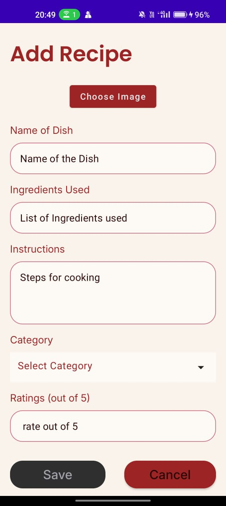
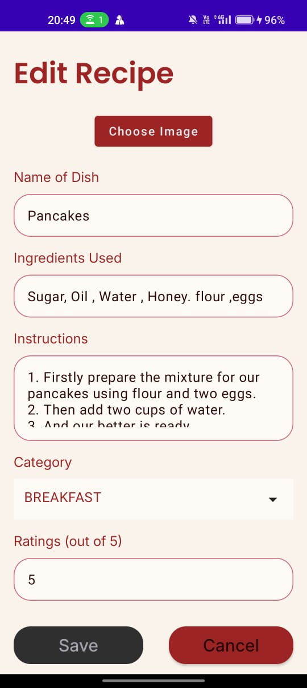
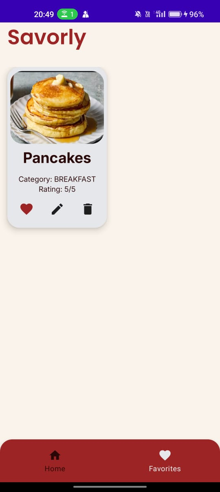

# Savorly App
# 🍽️ Savorly - Personal Recipe Manager App

Savorly is an intuitive Android application built to help users manage, organize, and explore their favorite recipes with ease. With features like custom categories, ingredient-based search, image support, and local storage, Savorly ensures your culinary ideas are always within reach.

---

## 📱 Features

- ✅ **Add / Edit / Delete Recipes**
- 🗂️ **Categorize Recipes** – Breakfast, Lunch, Dinner, Desserts
- 🔍 **Search Recipes** – by title or ingredients
- ⭐ **Mark Recipes as Favorites**
- 🗓️ **Save Recipe Creation Date**
- 🖼️ **Attach Optional Images**
- 📦 **Offline-first Experience** – backed by Room Database
- 🧠 **Modern MVVM Architecture** – Clean and maintainable
- 🧪 **Jetpack Compose UI** – Smooth and responsive design

---

## 🧑‍🍳 Screenshots

### Welcome Screen


### Home Screen


### Add New Recipe


### Recipe Detail View


### Edit Screen


### Favorites Screen


---

## 🧱 Tech Stack

| Layer       | Library / Tool              |
|-------------|-----------------------------|
| Language    | Kotlin                      |
| UI          | Jetpack Compose             |
| Architecture| MVVM                        |
| Database    | Room (SQLite)               |
| Dependency Injection | Hilt               |
| Image Loading | Coil                      |
| Navigation | Jetpack Navigation Compose  |

---

## 🗂️ Project Structure

```bash
com.savorly
├── data
│   ├── local (Room entities, DAO)
│   └── repository
├── domain (models, use cases)
├── ui
│   ├── screens (Home, AddRecipe, Details)
│   └── components
├── viewmodel
├── utils
└── di (Hilt modules)
